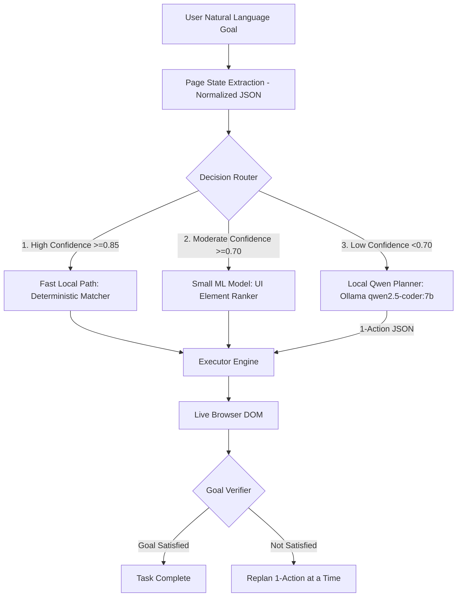

# ScreenPilot V2 Architecture Specification

> **Current state (final implementation):** the cascade is now Goal → PageStateService (+ PrivacySanitizer) → L1 → L2 → L3 (Qwen **or** Moondream, then cloud fallback) → Executor → Verify → replan only when needed. Screenshots are redacted locally before any model or network use. See **docs/SCREENPILOT_FINAL_DOCUMENTATION.md** (single source of truth).

## 1. Overview & Vision
ScreenPilot V2 evolves the system from a cloud-dependent LLM wrapper into a **local-first, hierarchical web automation agent**. 

Instead of routing every browser interaction through cloud API endpoints (e.g. OpenRouter / Gemini), ScreenPilot V2 introduces a 3-tier decision cascade designed for low latency, zero API costs, full privacy, and offline capability.

---

## 2. Hierarchical Decision Cascade

---

## 3. Core Architectural Layers

### 3.1 Layer 1: Fast Local Path (Deterministic)
- **Role**: Instantly matches obvious UI elements without calling ML models or LLMs.
- **Latency**: <5ms
- **Mechanism**: Evaluates goal keywords, visible button text, input placeholders, aria-labels, and standard form controls using `DOMMatcher`.
- **Coverage**: Handles 40–50% of routine actions (e.g. clicking "Submit", typing into a search box with placeholder "Search", clicking navigation links matching the goal).

### 3.2 Layer 2: Small ML Model (UI Element Grounding & Ranking)
- **Role**: Ranks candidate UI elements by relevance to user intent when exact text match is uncertain.
- **Latency**: <15ms
- **Hardware Target**: Optimized for Intel i5 CPU / RAM execution without GPU requirements.
- **Mechanism**: Computes feature vectors combining token overlap, semantic similarity, accessibility tree hierarchy, element role, and viewport region.

### 3.3 Layer 3: Local Qwen Planner (Ollama Fallback)
- **Role**: Reasons over complex, multi-option, or ambiguous screens.
- **Latency**: ~1.5–2.5s (CPU inference)
- **Model**: Quantized `qwen2.5-coder:7b` (Q4_K_M) running via local Ollama server (`http://127.0.0.1:11434`).
- **Mode**: Emits **1 structured action at a time** (JSON payload) to eliminate stale multi-step plans.

### 3.4 Execution & Verification Engine
- **Executor Engine**: Validates target element visibility/enabled state, scrolls into view, highlights element, and dispatches native events.
- **Goal Verifier**: Evaluates post-action state transition contracts (`url_matches`, `text_present`, `element_present`, `element_absent`) using 150ms condition-based polling.
- **Stale Plan Protection**: Compares pre/post page snapshots (`preSnap` vs `postSnap` DOM hashes) and aborts stale requests if the DOM/URL changed during planning.
